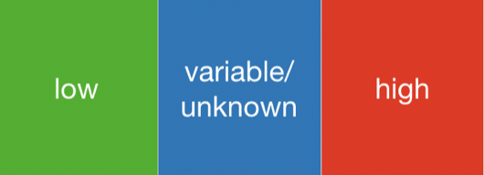
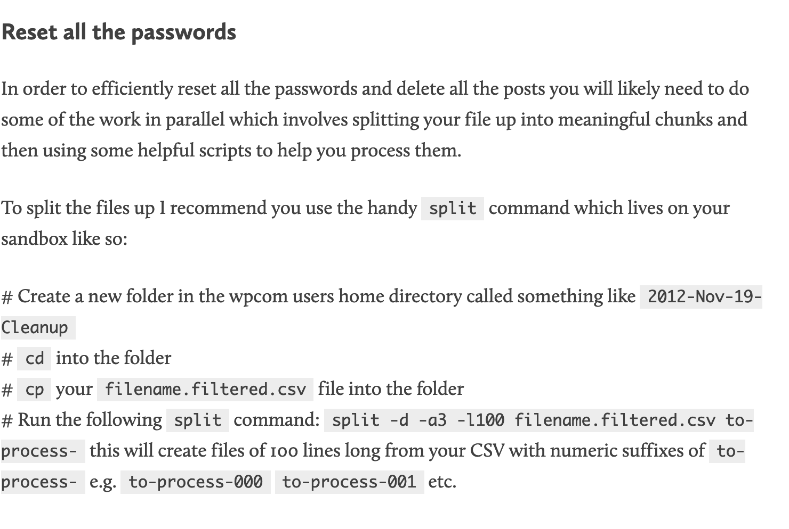

### WordPress security: a risk assessment approach

#### Matt Perry, WordPress VIP

---

# Hello!

### Matt Perry | Lead Engineer
### WordPress VIP
---

### What is VIP?

@css[ fragment ](WordPress in the enterprise)

@css[ fragment ](an Automattic company)

---

#### media

CBS / NBC / Meredith / NewsCorp / USAT / Postmedia / ESPN / Mother Jones / Think Progress / Grist / DFM ...

#### enterprise

Capgemini / Credit Karma / Santander / Alaska Airlines / Nielsen ...

#### technology

Facebook / Microsoft / Tinder / AirBnB ...

---

## scaling | security
 
---

# security

---

passwords? authentication? 2fa?

@css[ fragment ](updates?)

@css[ fragment ](bad code?)

@css[ fragment ](hosting/hardware/networking etc?)

@css[ fragment ](external/automated threats)

@css[ fragment ](human malfunctions?)

---

@quote[One of the main cyber-risks is to think they don’t exist. The other is to try to treat all potential risks](Stéphane Nappo)

---

### fear of everything

### fear of nothing

---

## risk management

---

@quote[the forecasting and evaluation of risks together with the identification of procedures to avoid or minimize their impact]

---

### risk management & WordPress

---

### 1 assess risks
### @css[ fragment ](2 build a response plan)

---

#### what this talk is not:

@css[ fragment ]( a technical deep-dive )

@css[ fragment ]( a list of tools )

@css[ fragment ]( tips/tricks/etc )

---

### know what the risks are

---

## parade of horribles

---

### authentication

---

incorrect identity verification

@css[ fragment ]( passwords / 2fa / sso / oAuth)

@css[ fragment ]( /wp-admin, /wp-json, frontend )

---

### over-permissioning

---

### old code

---

abandonware = unsupported and probably insecure

@css[ fragment ]( historically: < 50% of global WordPress installs are up to date )

@css[ fragment ]( plugins are worse )

---

### bad code

---

core

@css[ fragment ]( plugins / themes )

---

SQL injection

@css[ fragment ]( XSS )

@css[ fragment ]( exposed poor performance )

---

### evil results of bad code

@css[ fragment ]( data loss or theft )

@css[ fragment ]( unauthorized access )

@css[ fragment ]( outage )

@css[ fragment ]( malware and misbehavior )

---

### hardware / networking issues

---

hosting

@css[ fragment ]( lack of transparency and clear security policies )

@css[ fragment ]( insecure or outdated underlying stack -- PHP, nginx/apache, DBs etc ... )

@css[ fragment ]( certifications )

---

### external threats (robots)

---

(D)DOS / other automated attacks / brute force / ...

@css[ fragment ]( Spam )

---

### human malfunction

---

people are often:  generous, good-natured, careful

@css[ fragment ]( people are sometimes:  greedy, evil, careless )

---

### human malfunction

---

leaving secret stuff laying around

@css[ fragment ]( sharing secrets unsafely )

@css[ fragment ]( fraud )

@css[ fragment ]( phishing )

---

# !?

---

## likelihood
## @css[ fragment ]( severity )

---

### likelihood

some events are orders of magnitude more likely than others

@css[ fragment ]( experience, advice, research, nature of client or project )

@css[ fragment ]( goal: determine rough relative likelihood )

---

### severity

what exactly happens when things go wrong?

@css[ fragment ]( what's the worst case scenario? )

@css[ fragment ]( sources:  experience, advice, research )

@css[ fragment ]( it's okay not to admit we don't know! )

@css[ fragment ]( goal: determine rough relative severity )

---

### quantifying likelihood and severity

@css[ fragment ]( scales: binary? ternary? other scale? )

---

---

### risk assessment matrix

---

---

## example: a VIP's WordPress risk matrix

---

possibly a sensitive or high-profile sites
 
@css[ fragment ]( very active and well resourced code review/security/updates )

@css[ fragment ]( dedicated systems and security team and owned-to-metal hardware )

@css[ fragment ]( full control of our own data-centers and network ) 

---

---

### actionability

to what extent can we ourselves control or respond to this kind of risk? 

---

---

## severe & likely & actionable  

---

## priorities

1:  identity, human processes

@css[ fragment ]( 2:  code and updates ... actionable, variable severity, but well covered)

@css[ fragment ]( 3:  network/hardware, external threats ... even if severe, less likely and delegated)

---

## taking action

---

### reducing severity and likelihood

@css[ fragment ]( severity: improved disaster recovery, backups, configuration changes, tighter user permissioning, redundancy )

@css[ fragment ]( likelihood:  better identity verification, improved human procedures, code scanning and review, security plugins )

---

###  make a response plan

exactly what to do if something goes wrong

@css[ fragment ]( who is responsible for different sorts of incidents? you? someone else? )

@css[ fragment ]( construct recipes for all likely scenarios including detailed procedures, commands to run, utilities and tools etc. )

---

---

---

##  emergency toolkit

threat matrix

@css[ fragment ]( who is responsible for what, how to contact those people )

@css[ fragment ]( response plan )

@css[ fragment ]( communication plan )

---

##  next steps

make your own threat matrix

@css[ fragment ]( write down your response procedures )

@css[ fragment ]( who is responsible for what sort of incident? )

@css[ fragment ]( write down a full disaster plan )

@css[ fragment ]( consider communication -- to users, team, stakeholders )

---

# that's it!

@mattoperry | vip.wordpress.com